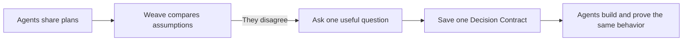
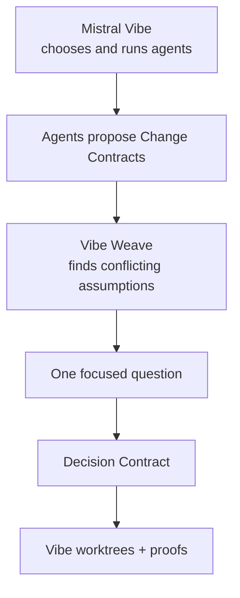

# Vibe Weave

<p align="center">
  <strong>Make parallel coding agents agree before they edit.</strong><br>
  A simple coordination layer for Mistral Vibe subagents.
</p>

<p align="center">
  <a href="https://www.glassbox.sugumaran-balasubramaniyan.com">Live interactive demo</a> ·
  <a href="https://www.glassbox.sugumaran-balasubramaniyan.com/static/vibe-weave-explainer.mp4?v=weave-v2">46-second product video</a> ·
  <a href="docs/MISTRAL-VIBE-INTEGRATION-PLAN.md">Future Vibe plan</a>
</p>

---

## Start here

> **In one sentence:** Before multiple agents write code, Vibe Weave makes them state their assumptions. If those assumptions clash, it asks one clear question and records the answer for everyone.



You do not need to understand agent orchestration to use this repository. Start with the **[3-minute quick start](#3-minute-quick-start)**, then open an **[example](examples/README.md)**.

## Why this exists

Parallel agents can each produce sensible code and still ship an inconsistent feature.

| Role | A reasonable assumption | The hidden problem |
| --- | --- | --- |
| Frontend | “Any signed-in user can export an invoice.” | The button appears for non-admins. |
| Backend | “Only admins can export.” | The API rejects that same user. |
| Tests | “Non-admins get 403.” | A rushed fix might weaken the test. |

Without a shared decision, a pull request can look complete while the product behavior is not.

**Vibe Weave catches the disagreement before managed edits begin.**

## What happens in a Vibe Weave run

```text
1. SAY THE PLAN       Each role declares files, assumptions, interfaces, and proof.
          ↓
2. SPOT THE CLASH      Weave finds incompatible meanings for the same decision.
          ↓
3. AGREE ONCE          A person or configured policy answers one focused question.
          ↓
4. BUILD SAFELY        Roles work in isolated worktrees with the shared answer.
          ↓
5. PROVE IT            A report shows the decision and the evidence that passed.
```

### The two small records that matter

| Record | Plain-English meaning |
| --- | --- |
| **Change Contract** | “Here is what I plan to change, what I believe, and how I will prove it.” |
| **Decision Contract** | “Here is the one answer every affected agent must now follow.” |

## 3-minute quick start

### 1. Set up the project

```bash
python3 -m venv .venv
.venv/bin/pip install -r requirements.txt
```

### 2. Run the safe, deterministic proof

```bash
PYTHONPATH=. .venv/bin/python -m vibe_weave drill --output /tmp/vibe-weave-proof
sed -n "1,160p" /tmp/vibe-weave-proof/weave-report.md
```

You will see:

```text
Question: Who may export invoices?
Resolved: admin_only
Isolated worktrees: PASS
Contracts converged: PASS
Authorization policy: PASS
```

### 3. Explore the visual version

```bash
PYTHONPATH=. .venv/bin/uvicorn app.main:app --host 127.0.0.1 --port 8000
```

Open [http://127.0.0.1:8000](http://127.0.0.1:8000), select **Live proof**, then press **Resolve & prove**.

> Tip: select **Any authenticated user** once to see the intentional failed proof. Then select **Admins only** to see the safe route pass.

## Learn by example

Real systems rarely disagree about code syntax. They disagree about product meaning.

| Example | Product decision | What you learn |
| --- | --- | --- |
| [Invoice export](examples/invoice-export) | Who may export? | Permission rules must match UI, API, and tests. |
| [Checkout discount](examples/checkout-discount) | Can discounts stack? | One pricing rule prevents charging the wrong amount. |
| [Database migration](examples/database-migration) | May production data be dropped now? | A rollout decision must match code, schema, and tests. |

Each example contains a short story and a `contracts.json` file you can read without running code. See the [examples guide](examples/README.md) first.

## How Vibe Weave fits Mistral Vibe

Vibe Weave is not a replacement agent framework and does not replace Vibe orchestration.



| Mistral Vibe does this | Vibe Weave adds this |
| --- | --- |
| Delegates work and runs tools | A shared definition of done before parallel edits |
| Manages subagents | Conflict detection across subagent assumptions |
| Supports project-local hooks | A guard that holds writes only while a recorded conflict is unresolved |
| Produces implementation output | An auditable decision and proof report |

The project-local integration pieces are already included:

```text
.vibe/agents/weave-coordinator.toml
.vibe/skills/vibe-weave/SKILL.md
.vibe/hooks.toml
```

Read the **[future Mistral Vibe integration plan](docs/MISTRAL-VIBE-INTEGRATION-PLAN.md)** for the proposed upstream path from companion package to first-class Vibe workflow.

## Repository map

```text
vibe_weave/          The small coordination engine and CLI
examples/            Beginner-friendly product scenarios
.vibe/               Mistral Vibe agent, skill, and hook configuration
static/              Public demo UI and narrated explainer video
app/weave_api.py     Browser endpoint for the deterministic proof
tests/test_vibe_weave.py  Engine and proof behavior tests
docs/                Deeper explanation and future integration plan
```

## Trust and scope

- The web proof is deterministic and credential-free.
- It creates **temporary Git worktrees only**; it does not modify your project repository.
- The bundled guard is transparent when there is no unresolved conflict.
- Contracts should contain decisions and proof metadata—not raw prompts, credentials, or tool transcripts.
- Live observability uses redacted, bounded action/result summaries; it excludes raw tool input/output, shell commands, and workspace paths.
- Live Vibe enforcement is opt-in through the project-local hook configuration.

## Verify changes

```bash
PYTHONDONTWRITEBYTECODE=1 PYTHONPATH=. .venv/bin/pytest -p no:cacheprovider tests -q
node --check static/weave-v2.js
```

## Next reading

- [Examples guide](examples/README.md)
- [Vibe Weave concepts and terminal demo](docs/VIBE-WEAVE.md)
- [Future Mistral Vibe integration plan](docs/MISTRAL-VIBE-INTEGRATION-PLAN.md)
- [Live Vibe hook integration notes](docs/VIBE-INTEGRATION.md)

## License

[MIT](LICENSE)
